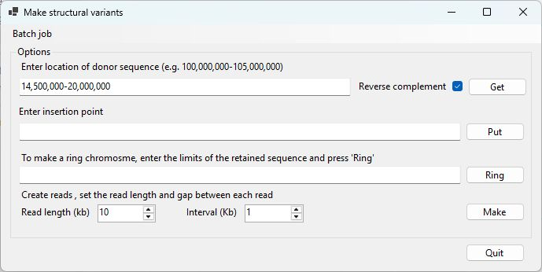
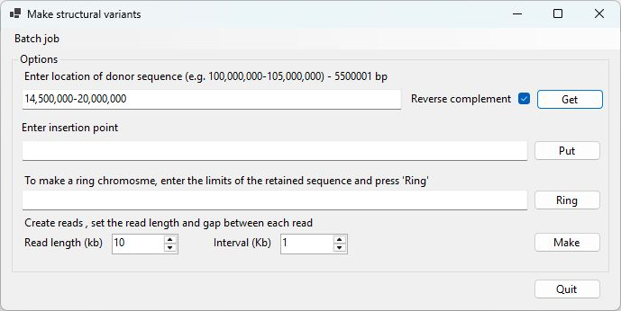

# MakeSVGenome user guide

## Data files

To create a synthetic chromosome, ___MakeSVGenome___ requires the base chromosome sequence for the standard chromosome and the donor chromosome sequence when making translocations or chromosomes with inserts from another chromosome. These sequences should be imported as uncompressed plain text, fasta files. Each file should contain a single sequence.

The name of the resultant sequence in the fasta file is the same as the name for the original base sequence (i.e. > chr7). 

Chromosome sequences can be obtained from a number of sources, but the [Genome browser download page](https://hgdownload.soe.ucsc.edu/downloads.html) has most model organisms.

**Consideration:** When choosing a base file, it is a good idea to select one that contains few N bases, for instance human chromosomes 21 and 22 contain long stretches of polyN at the 5 prime end. Obviously, inserting a sequence composed of Ns in to a region consisting of Ns will be of little use.

## Selecting the transposed sequence.

If you want to insert a region starting at 14,500,000 bp and ending at 20,000,000 bp of a reference sequence, enter 14,500,000-20,000,000 in the first text area. If you wish to insert the reverse complement of this sequence, tick the **Revere complement** option. To import the isnert sequence press **Get** (figure 1a). This will then prompt you to select the fasta file that contains the source of insert. When the sequence has been retrieved, its length will appear in the text above the text area (Figure 1b)

**Note:** To create a deletion omit this step so no sequence is inserted.

Figure 1a

Figure 1b

## Selecting the recipient sequence

Next, in the lower text area enter the location you wish the insert be located at. If you want the insert to replace sequence in the base sequence enter the coordinates such as 10,300,000-10,330,000 (Figure 2a). This will delete this sequence and insert the selected sequence from the first step in its place. If you want the sequence to be inserted without deleting any sequence in the base chromosome, enter the same coordinate twice for example 14,500,000-14,500,000 (figure 2b). Finally, press the **Put** button and select the base chromosome, followed by the name and location of the resultant fasta file.

 hr />

Figure 2a

Figure 2b

## Making data in batches

The process of sequence production can be automated by entering a tab-delimited file containing the required databy pressing the **Batch job** menu option in the top left of the interface. This file should be formated as follows. 

|Column 1|Column 2|Column 3|Column 4|Column 5|Column 1|
|-|-|-|-|-|-|
|Name of insert source file|Insert coordinates|Reverse complement: TRUE or FALSE|Name of base sequence file|Coordinates for the inserts location|Folder to save files too.|
|C:\fasta\chr8.fa|14,500,000-20,000,000|TRUE|C:\fasta\chr7.fa|10,300,000-10,330,000|C:\fasta\synthetic|

The last line of the table above will insert the reverse complement of chr8:14,500,00-20,000,000 in to the chr7.fa file between 10,300,000-10,330,000 bp. The name of the file is automatically generated and would be:

insert_chr8_14,500,000-20,000,000_RC_target_chr7_10,300,000-10,330,000.fa

## Creating the synthetic read data

At the bottom of ***MakeSVGenome***'s interface are two number controls that allow you to set the read length and interval between the start points of consecutive reads. The values represent kilobases, so a value of 2 represents 2,000 bp. The default values create reads of 10 kb at 1 kb intervals, so the read depth is about 10x for the majority of chromosome. 

Place the fasta file(s) containing the synthetic sequence in a folder that doesn't contain any other fasta files and press the **Make** button and select the folder (Figure 3). Once selected, ***MakeSVGenome*** will inturn create a gzip compressed fastq data file with the same name as each fasta file in the folder and store the reads in the file. The Quality string for each base is set to __F__. The location in Mb will be displayed in ***MakeSVGenome***'s title bar. 

If you create a translocation or insert data in from a different sequence you may wish create reads from the the source fasta file as well and combine reads from the modified chromosome as well as the insert source file. Combining the read files can be done on a Linux server using a command like:

>zcat file1.fastq.gz file2.fastq.gz | gzip > file1and2.fastq.gz

## Aligning the reads to a reference file

The read data should be aligned to a reference sequence containing all the fasta files used to make the synthetic chromosomes. The alignment can easily be done using Minimap2 with a command similar too:

>minimap2  -ax map-ont -t 4 reference.fa reads.fastq.gz > alignment.sam

This can then be converted to a bam file with:

>samtools view -bS alignment.sam | samtools sort -o alignment.bam

and indexed with:

>samtools index alignment.bam
