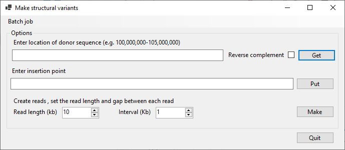

# MakeSVGenome

## Contents

- [MakeSVGenome](#makesvgenome)
  - [Contents](#contents)
  - [Introduction](#introduction)
  - [Guide](#guide)
  - [Download](#download)
  - [Running on Linux systems](#running-on-linux-systems)
  
## Introduction



```MakeSVGenome``` is designed to create chromosomes that contain structural rearrangements and synthetic long read sequencing data that can then be used to test the accuracy of structural variant detection programs or pipe lines. 

The read data produced, consists of reads of fixed length and spacing, that alternate between forward and reverse orientations. Other than the structural variants, no other mutations or sequence variants are added. This makes it easy to determine the data is not real experimental data and so of no use other than algorithm testing.

The software can be used to manually create chromosomes or in batch mode to create a number of chromosomes as described in a batch file.


## Guide

The user guide is [here](Guide/README.md).

## Download

The prebuilt program can be downloaded [here](download/README.md).

## Running on Linux systems

The prebuilt programs can be run on Linux (and macOS) using the Wine package as described [here](https://github.com/msjimc/RunningWindowsProgramsOnLinux).
